# Análisis Exploratorio de Datos — MedXpertQA (Paso 1 · Tarea C)

- **Generado**: 2026-07-10T09:52:31.111147+00:00 (UTC), por `src/eda.py` (semilla 42).
- **Fuente**: `TsinghuaC3I/MedXpertQA` (revisión `7e7c465a68eb2b866926bfa59c8c9d17a8daba65`).
- **Alcance**: conjunto de *test* (MM = 2000, Text = 2450). El *dev* (5+5) se reserva como pool de few-shot.
- **Trazabilidad**: cada cifra procede de una función de `src/eda.py`; las tablas están en `outputs/tables/` y las figuras en `outputs/figures/`.

## 0. Esquema real de los datos

Confirmado por inspección de los ficheros descargados (no asumido):

| Campo | Tipo | MM | Text |
|---|---|---|---|
| `id` | str | `MM-<n>` | `Text-<n>` |
| `question` | str | enunciado | enunciado |
| `options` | **dict** | claves A–E (5) | claves A–J (10) |
| `label` | **str** (1 letra) | ∈ opciones | ∈ opciones |
| `images` | **list[str]** | 1–6 basenames | *(ausente)* |
| `medical_task` | str | Diagnosis/Treatment/Basic Science | idem |
| `body_system` | str | 12 categorías | 12 categorías |
| `question_type` | str | Reasoning/Understanding | idem |

La integridad del dato está verificada en [`00_integridad.md`](00_integridad.md) (recuentos 2000/2450, correspondencia imagen↔archivo exacta, 0 imágenes corruptas, IDs únicos, `label`∈`options` al 100 %).

## C.1 — Metadatos y estructura

### Distribución por sistema corporal

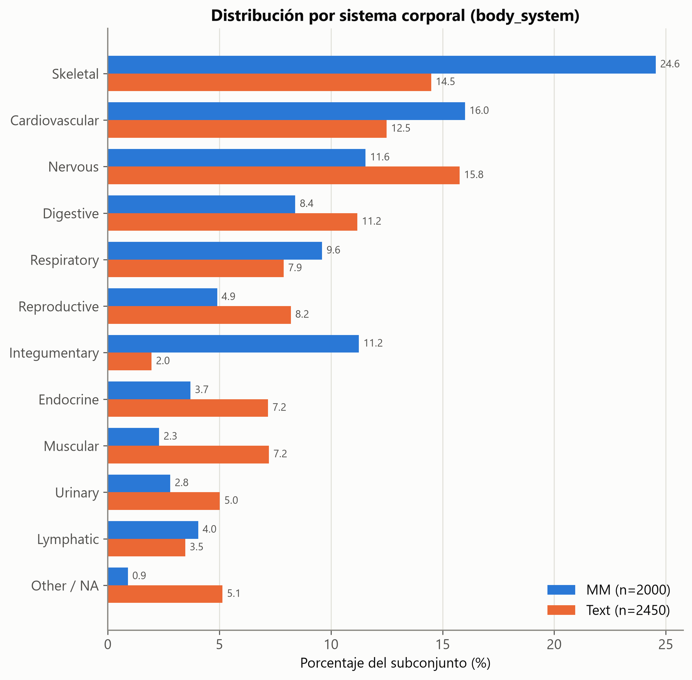

El eje `body_system` cubre 12 categorías. En **MM** domina **Skeletal** (491, 24.55 %), mientras que en **Text** domina **Nervous** (386, 15.76 %). La diferencia más relevante para el diseño es *Integumentary* (piel): 11.25 % en MM frente a 1.96 % en Text — coherente con que la dermatología es intrínsecamente visual. Lo mismo ocurre con *Skeletal* (traumatología/radiología), sobre-representado en MM.

### Distribución por tarea médica y tipo de pregunta

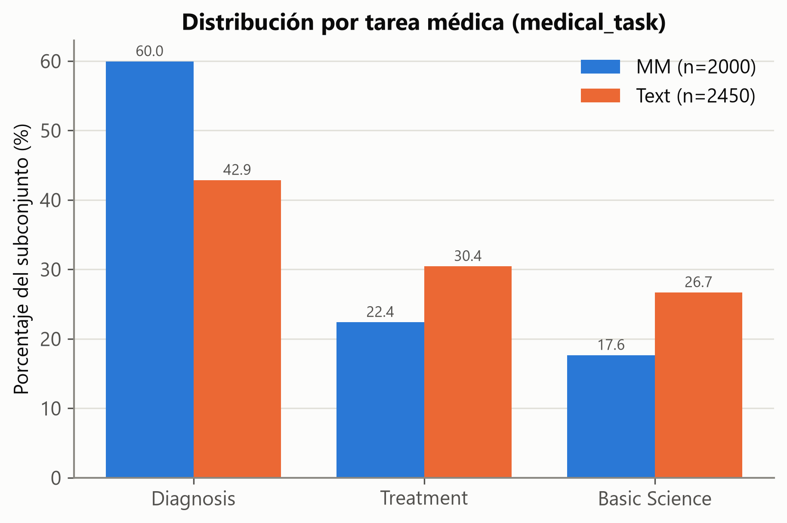

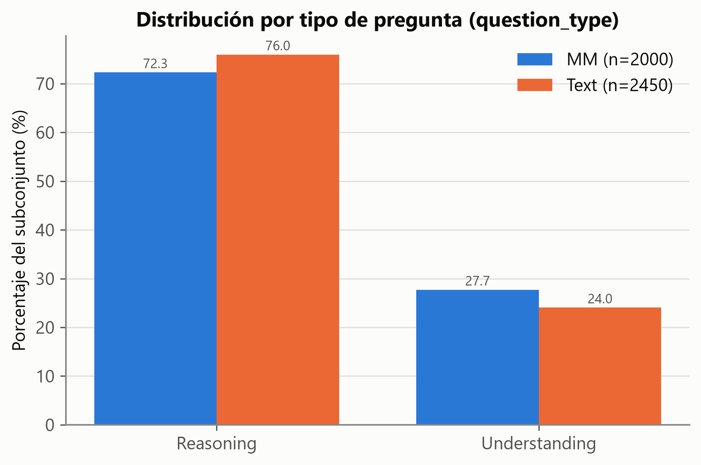

*Diagnosis* es la tarea mayoritaria en ambos (MM 59.95 %, Text 42.86 %). En cuanto al tipo, **Reasoning** predomina claramente (MM 72.3 %, Text 75.96 %): el benchmark está diseñado para exigir razonamiento clínico, no mero reconocimiento.

### Tablas cruzadas

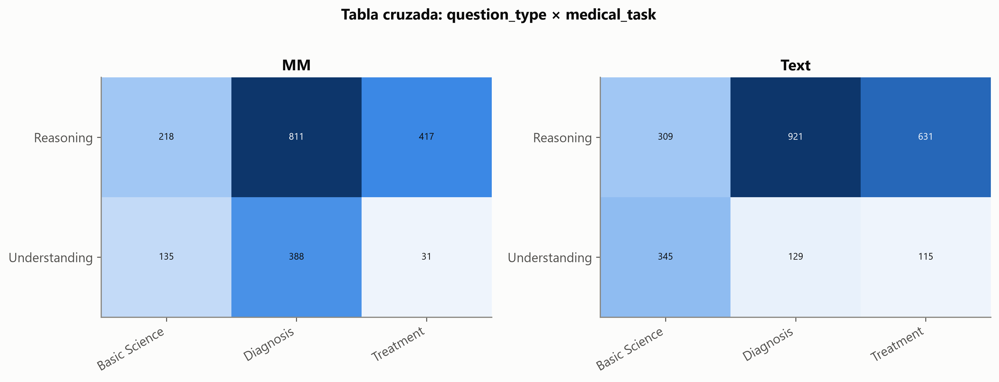

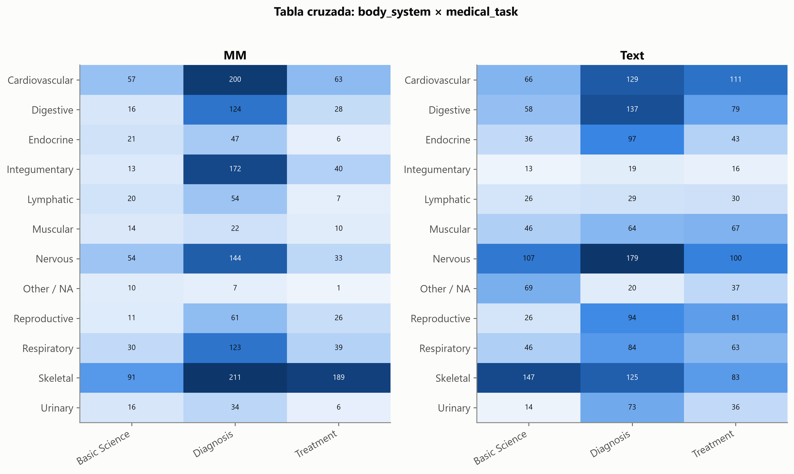

El cuadrante dominante es **Reasoning × Diagnosis**, seguido de Reasoning × Treatment. Las tablas completas están en `outputs/tables/c1_cross_*.csv`.

### Nº de opciones y de respuestas correctas

- MM: todas las preguntas tienen exactamente 5 opciones (`True`); Text, 10 opciones (`True`).
- **Siempre 1 respuesta correcta**: MM `True`, Text `True`. El formato es de opción única (single-label), lo que habilita una métrica de *accuracy* directa por letra.

## C.2 — Chequeo de sesgos (posición de la respuesta)

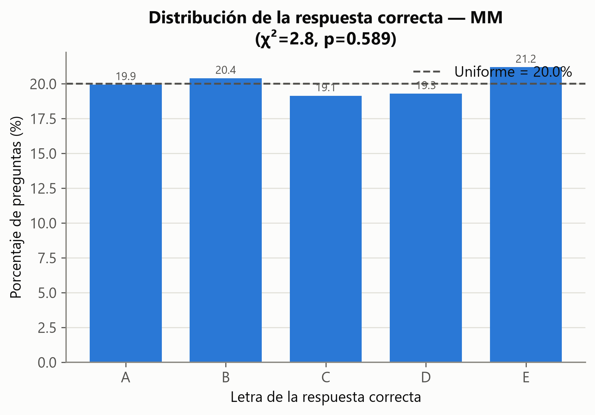

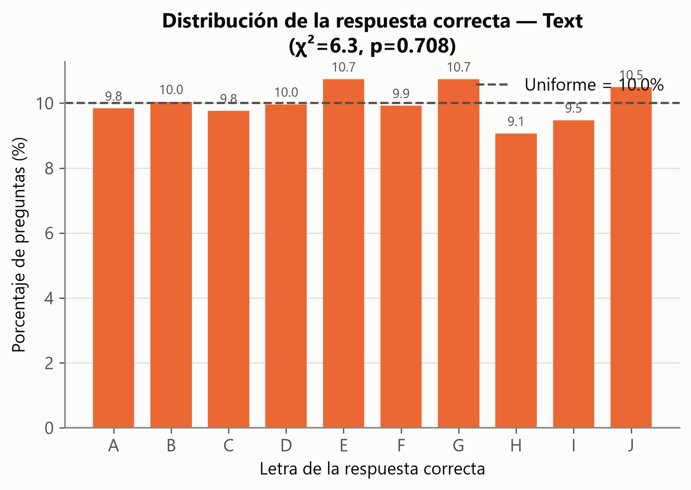

La respuesta correcta se reparte entre las letras sin sesgo posicional explotable. En **MM**, la baseline de azar es 20 % y la de «responder siempre la letra más frecuente» (E) sube solo a 21.2 %. En **Text**, azar 10 % vs mayoría 10.7 % (letra E). El test χ² de uniformidad da p=0.589 (MM) y p=0.708 (Text): no se rechaza la uniformidad, por lo que no hay atajo posicional.

> **Implicación**: cualquier modelo debe superar con holgura estas baselines (21.2 % en MM, 10.7 % en Text) para considerarse informativo.

## C.3 — Análisis del texto

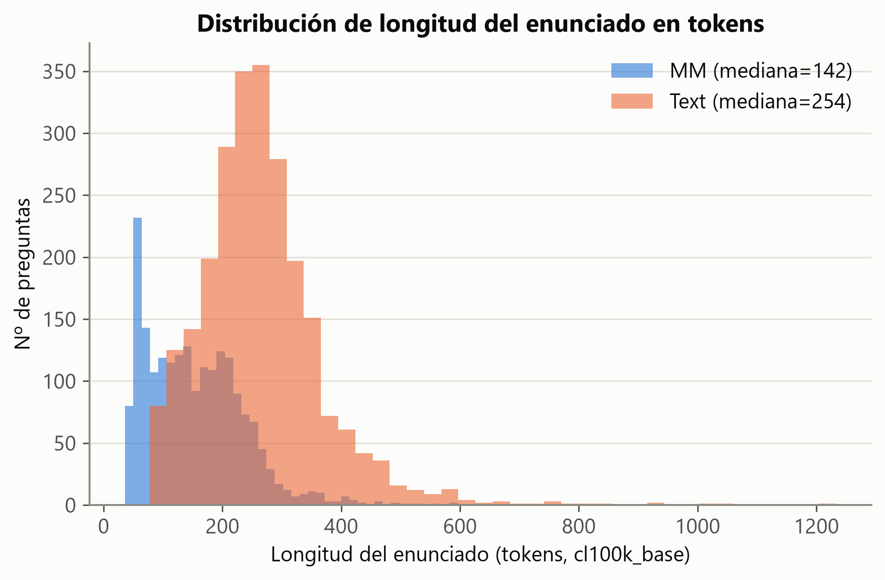

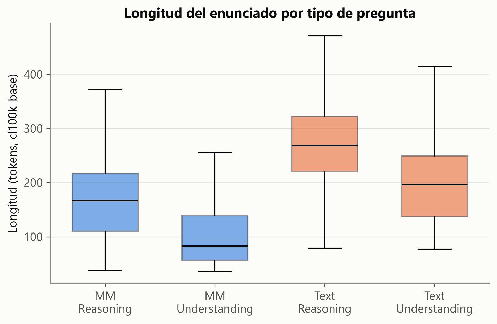

Longitud del **enunciado** (mediana de tokens cl100k): MM ≈ 142, Text ≈ 254; el percentil 95 llega a 285 (MM) y 438 (Text). Incluyendo las opciones (prompt completo), la mediana sube a 187 (MM) y 355 (Text). Se reporta también el tokenizador de Qwen2.5-VL. Las preguntas de *Text* son más largas (10 opciones, muchas con viñetas clínicas extensas), lo que anticipa mayor coste de contexto en la fase de evaluación.

### Casi-duplicados de texto

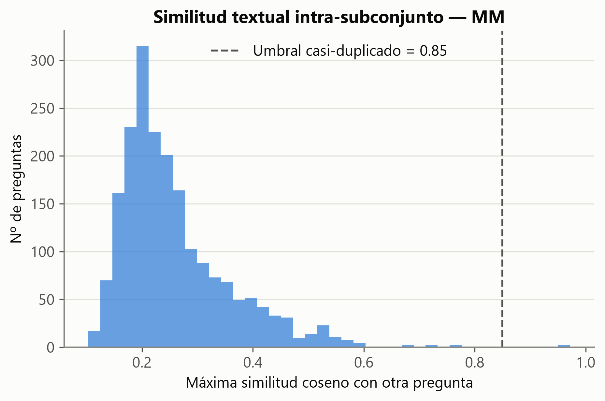

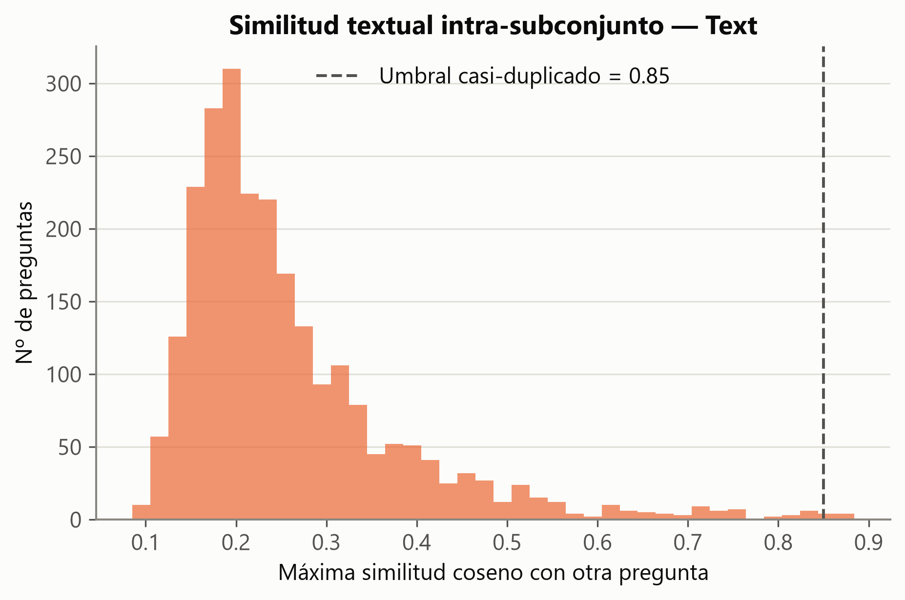

Con normalización + hash exacto no se detectan grupos de enunciados idénticos (**0** grupos). Por TF-IDF + coseno (umbral 0.85) aparecen **5** pares de alta similitud (ver `c3_near_duplicates.csv`), útiles como línea base para el control de contaminación cuando se introduzcan datasets de entrenamiento.

## C.4 — Componente visual (solo MM)

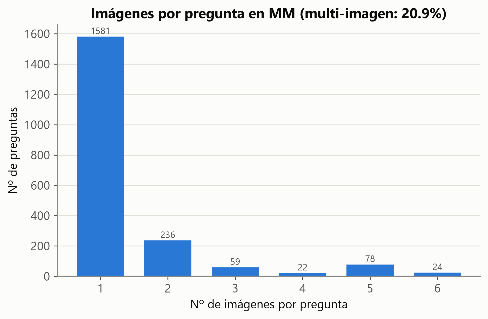

El **20.9 %** de las preguntas MM son multi-imagen (hasta 6 imágenes; 2852 referencias totales). Esto es determinante para el pipeline: no todos los VLM open-source manejan bien varias imágenes por prompt, y habrá que decidir estrategia de composición (mosaico único vs varias imágenes).

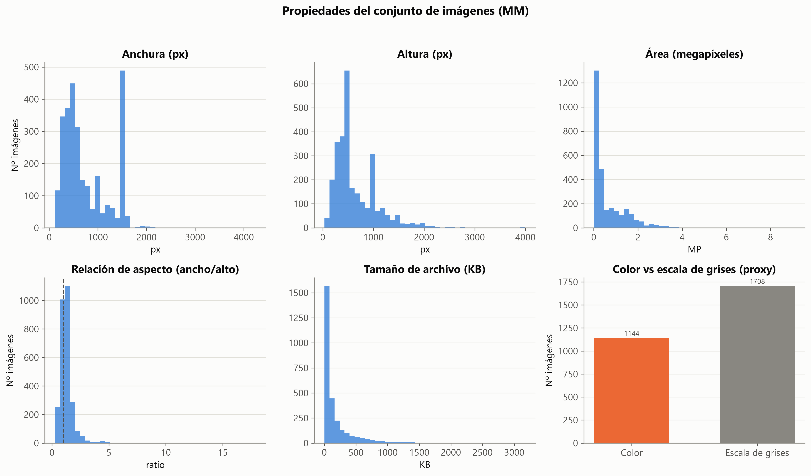

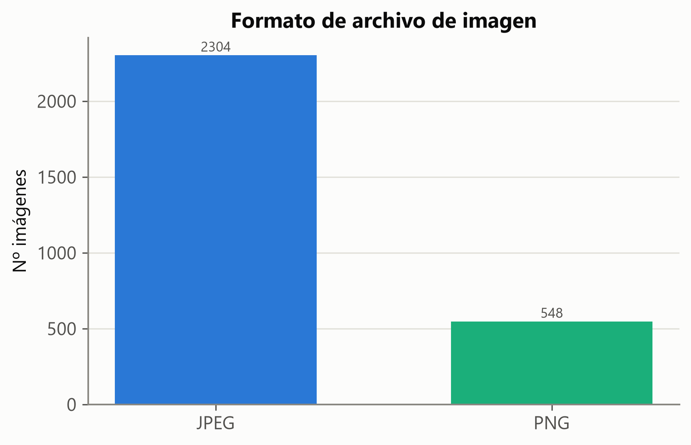

Formatos: JPEG: 2304, PNG: 548. Reparto color/gris (proxy): **1144** en color y **1708** en escala de grises — una señal indirecta de modalidad (radiografía/TAC/RM tienden a gris; histología y fotografía clínica, a color). Huella total en disco: **524.2 MB** para 2852 imágenes (relevante para el almacenamiento en el VPS).

### Hoja de contactos para anotación de modalidad

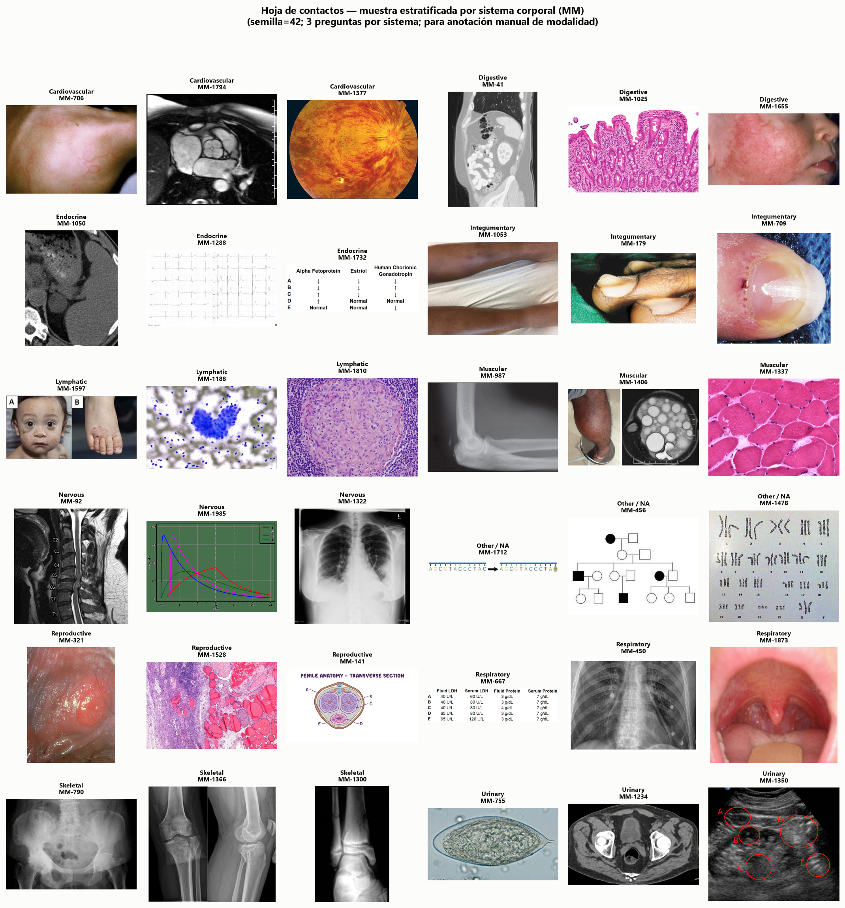

**Limitación documentada**: el dataset **no** incluye etiqueta de modalidad de imagen (radiografía / TAC / RM / histología / fotografía clínica / ECG…). No se infiere ni se inventa. Como caracterización cualitativa, la hoja de contactos anterior es una muestra aleatoria estratificada por `body_system` (semilla fija) para inspección y anotación manual. *Método reproducible propuesto* (marcado como aproximación, no ejecutado aquí): heurística color/aspecto + *clustering* de embeddings visuales (p. ej. del propio encoder del VLM) para agrupar modalidades sin supervisión, validado sobre una muestra anotada a mano.

### Hashes y duplicados exactos

Se calcularon hash perceptual (pHash) y hash exacto (md5) de las 2852 imágenes (tabla `c4_image_properties.csv`), reutilizables para detectar solapamiento con datasets de entrenamiento (control de fuga de datos). Duplicados **exactos** (mismos bytes) dentro de MM: **35** grupos (75 ficheros implicados; ver `c4_exact_duplicates.csv`).

**Cruce imagen↔texto (hallazgo de calidad del benchmark).** Estos duplicados exactos implican **42** pares de preguntas MM que comparten al menos una imagen idéntica. De ellos, **1** tiene además un enunciado muy similar (coseno TF-IDF > 0,8), lo que apunta a preguntas **casi-duplicadas** dentro del propio test set. El caso más claro es **MM-121 / MM-174** (imagen idéntica y similitud textual 0.972). El resto reutiliza la misma imagen en preguntas clínicamente distintas. Detalle en `c4_duplicate_question_pairs.csv`. Es un dato a tener en cuenta al interpretar la *accuracy* agregada y como línea base para el control de fuga de datos.

## C.5 — Relación texto ↔ imagen (solo MM)

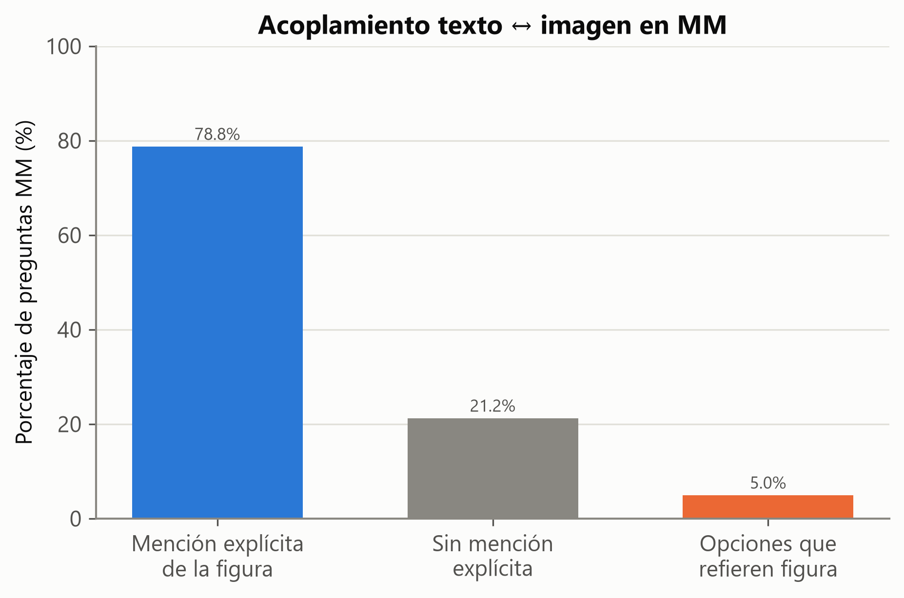

El **78.8 %** de las preguntas MM menciona explícitamente la figura en el enunciado (términos como *figure, shown, radiograph, image, arrow…*); el resto la referencia de forma implícita (p. ej. «este paciente presenta…»). Además, en el **5.0 %** de las preguntas alguna **opción de respuesta** remite a una figura, casos en los que la imagen es imprescindible para responder.

*Ejemplo con mención explícita* (`MM-0`): «A 26-year-old man falls from a ladder, landing on his outstretched right hand. He is evaluated in the emergency department and diagnosed with a closed elbow injury without neurovas…»

*Ejemplo sin mención explícita* (`MM-1`): «This patient presents for mammographic needle localization of a bar clip. What is the MOST optimal  approach for needle localization?
Answer Choices: (A) Lateral (B) Inferior (C) M…»

> **Conclusión de acoplamiento multimodal**: aunque no todas las preguntas nombran la figura, todas las de MM traen imagen y una fracción sustancial es visualmente dependiente (mención explícita y/o opciones que remiten a figuras). El subconjunto MM **no** es resoluble de forma fiable solo con texto; la imagen es central, no accesoria.

## Hallazgos clave e implicaciones para el diseño del sistema

1. **VLM con soporte multi-imagen**: el 20.9 % de MM usa varias imágenes (hasta 6). Conviene un VLM que acepte múltiples imágenes por prompt (Qwen2.5-VL las soporta) o una estrategia de mosaico bien definida.
2. **Presupuesto de contexto**: mediana ≈ 355 tokens de prompt en Text y percentil 95 en torno a 589; más los tokens visuales en MM. Dimensionar la ventana y el coste en consecuencia.
3. **Baselines honestas**: reportar azar y mayoría (C.2) evita sobre-estimar el mérito del modelo; el sesgo posicional no es explotable.
4. **Dificultad = razonamiento**: predominio de *Reasoning × Diagnosis* → el sistema se pondrá a prueba en integración de evidencia clínica, no en reconocimiento superficial; el CoT y el RAG deberían aportar aquí.
5. **Modalidad no etiquetada**: limitación real; si la modalidad importa para el análisis de errores, habrá que anotarla (heurística/clustering) como paso aparte.
6. **Sesgo temático MM**: sobre-peso de dermatología y traumatología; el rendimiento por `body_system` debe reportarse desagregado para no ocultar debilidades por especialidad.

## Decisiones pendientes (para validación)

- **dev.jsonl**: se mantiene como pool de few-shot; el EDA se centra en *test*. (Anomalía documentada: `Basic Medicine` en MM/dev ≡ `Basic Science` de test.)
- **Preguntas multi-imagen**: cuantificadas aquí; el tratamiento en el pipeline (mosaico vs multi-imagen nativa) queda para el diseño del sistema.
- **Tokenizador Qwen2.5-VL**: cargado y reportado.

