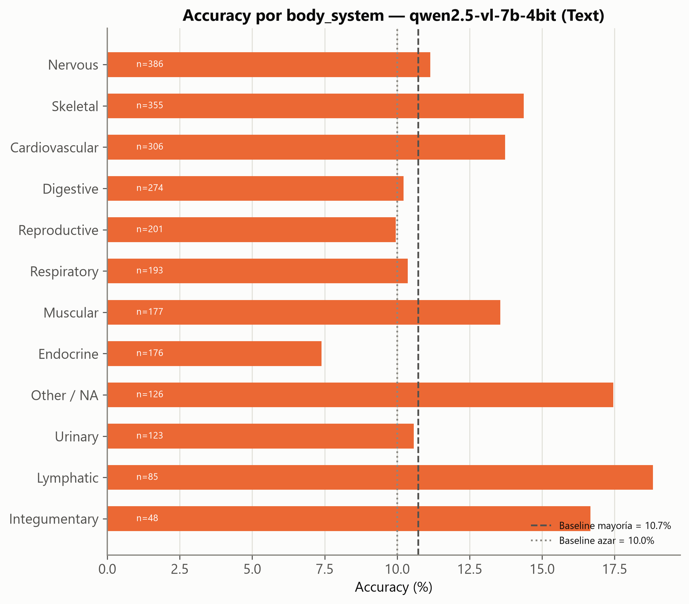
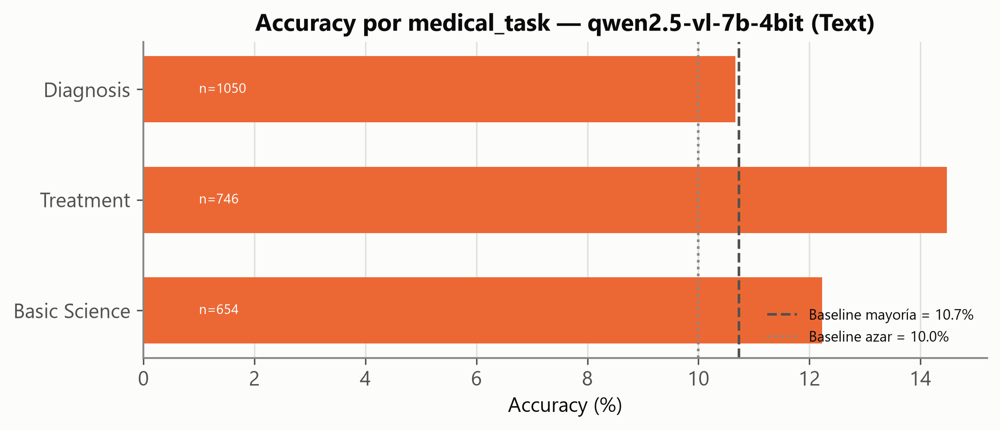
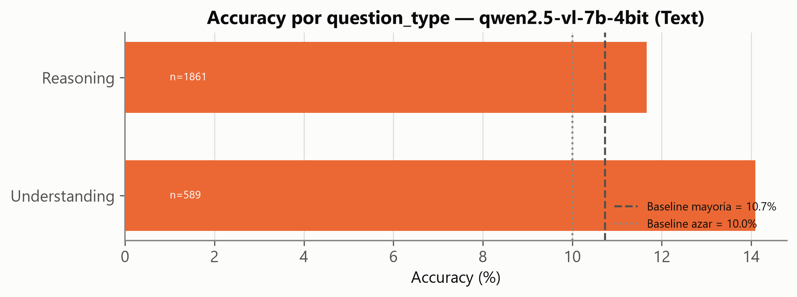

# Baseline Zero-Shot — MedXpertQA · Text (Paso 2)

- **Generado**: 2026-07-13T12:47:28.832874+00:00 (UTC), por `src/evaluate.py` (semilla 42).
- **Fuente**: `TsinghuaC3I/MedXpertQA` (revisión `7e7c465a68eb2b866926bfa59c8c9d17a8daba65`), subconjunto **Text/test** (2.450 preguntas, 10 opciones A–J, sin imagen).
- **Modelo**: `Qwen/Qwen2.5-VL-7B-Instruct`, cuantizado a **4-bit NF4** (bitsandbytes, `compute_dtype=bfloat16`). Cupo en los 8 GB de VRAM de la GPU local (RTX 3070) sin necesidad de caer al modelo 3B.
- **Trazabilidad**: predicciones en [`outputs/eval/text_qwen2.5-vl-7b-4bit.jsonl`](../eval/text_qwen2.5-vl-7b-4bit.jsonl); métricas agregadas en [`outputs/eval/metrics_qwen2.5-vl-7b-4bit.json`](../eval/metrics_qwen2.5-vl-7b-4bit.json).

> **VEREDICTO**: accuracy global **12.24 %**, por encima de la baseline de mayoría (10.73 %) pero con un margen estrecho (IC95 Wilson [11.01 %, 13.60 %] vs. 10.73 %). El baseline zero-shot es débil: confirma la necesidad de CoT/RAG/fine-tuning previstos en los siguientes pasos del TFG, no un resultado inesperado a depurar.

## 1. Configuración del harness

- **Prompt**: mensaje *system* fijo ("actúa como examinador médico, responde solo con la letra") + enunciado + opciones `A–J` formateadas una por línea, vía `apply_chat_template` de Qwen.
- **Generación determinista**: `do_sample=False` (greedy), `max_new_tokens=8`.
- **Parseo de la letra**: regex en cascada (patrón "Answer/Respuesta: X" → letra al inicio → primera letra A–J aislada), validado contra las claves reales de `options` de cada pregunta.
- **Entorno**: `torch 2.11.0+cu128`, `transformers 4.57.6`, GPU `NVIDIA GeForce RTX 3070` (8.6 GB VRAM reportados por `torch.cuda`). Tiempo total: 1374 s (2.450 preguntas ≈ 0.56 s/pregunta).

## 2. Resultado global vs. baselines

| Métrica | Valor |
|---|---:|
| Accuracy global | **12.24 %** |
| IC95 (Wilson) | [11.01 %, 13.60 %] |
| Baseline azar (Text, 10 opciones) | 10.00 % |
| Baseline mayoría (letra E, de C.2) | 10.73 % |
| Respuestas no parseables | 0 / 2.450 |

El parseo fue perfecto (0 fallos): el modelo respeta la instrucción de responder solo con la letra en el 100 % de los casos, así que el resultado no está contaminado por errores de extracción. La distribución de letras predichas está razonablemente repartida entre A–J (mínimo I=112, máximo D=346, sobre 2.450), sin un colapso hacia una única letra, aunque con algo más de peso en D/B/C/H que en I/G/F — a vigilar si se repite en pasos posteriores.

## 3. Accuracy desagregada

### Por sistema corporal (`body_system`)

El rango va de **Endocrine (7.4 %, n=176)** — por debajo incluso del azar (10 %) — a **Lymphatic (18.8 %, n=85)**. La mayoría de sistemas se mueve en la banda 10–15 %, cerca de las baselines: el modelo no muestra una ventaja clara de conocimiento clínico específico por especialidad en zero-shot.

### Por tarea médica (`medical_task`)

**Treatment** (14.5 %, n=746) y **Basic Science** (12.2 %, n=654) superan claramente a **Diagnosis** (10.7 %, n=1.050) — precisamente la tarea mayoritaria del subconjunto (42.9 % de Text, ver C.1) y la que queda prácticamente empatada con la baseline de mayoría. El diagnóstico diferencial zero-shot es el punto más débil del modelo, coherente con ser la tarea de mayor carga de razonamiento clínico.

### Por tipo de pregunta (`question_type`)

**Understanding** (14.1 %, n=589) supera a **Reasoning** (11.7 %, n=1.861), que domina el subconjunto (75.96 % de Text, ver C.1). Confirma la lectura de C.1/C.2: el benchmark exige razonamiento clínico multi-paso, terreno donde el zero-shot rinde peor — la motivación central para introducir CoT en el Paso 3.

## 4. Primeros errores observados (inspección manual)

**Ejemplo de acierto** (`Text-91`, Understanding): pregunta sobre inmunología de células B con clínica de mononucleosis; el modelo identificó correctamente la opción **A** entre 10 alternativas técnicas muy similares en redacción.

**Ejemplo de error** (`Text-521`, Diagnosis): paciente pediátrico con fibrosis quística e infecciones respiratorias de repetición — el patrón clínico (meconium ileus + FQ + infecciones recurrentes) apunta a **Burkholderia cepacia** (`J`, la respuesta correcta), pero el modelo predijo **Pseudomonas aeruginosa** (`A`), el patógeno *más frecuente* en FQ pero no el que el enunciado señala específicamente. Es representativo del patrón de error dominante: el modelo tiende a responder con el diagnóstico/patógeno estadísticamente más común en vez de integrar los detalles distintivos del caso — exactamente el tipo de error que un CoT explícito (forzar a enumerar los hallazgos antes de responder) debería mitigar.

## 5. Decisiones y anomalías

- **Ninguna anomalía de infraestructura**: el modelo 7B en 4-bit cupo en los 8 GB de VRAM sin activar el *fallback* a 3B (`cayo_a_3b_por_oom: false`); no fue necesario degradar el modelo.
- **Baseline superada con margen estrecho**: el IC95 no se solapa con la baseline de mayoría, así que la mejora es estadísticamente defendible, pero el margen absoluto (~1.5 puntos) es pequeño. Se recomienda usar este número, no una futura repetición con otra semilla, como referencia fija para medir el delta de CoT/RAG/QLoRA.
- **Pendiente para el roadmap** (ver `01_PLAN_PASO_2.md` §8): extender el harness a MM (con imágenes), Paso 3 (CoT / *self-consistency*) y Paso 4 (RAG) sobre este mismo baseline.

> **Actualización**: el harness ya se extendió a MM — ver [`02b_baseline_mm.md`](02b_baseline_mm.md). El piloto de Chain-of-Thought (Paso 3) sobre este mismo baseline está en [`03_cot_pilot.md`](03_cot_pilot.md).
