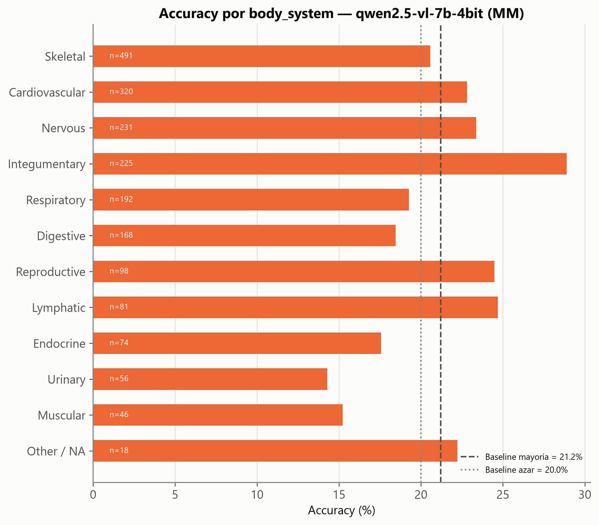
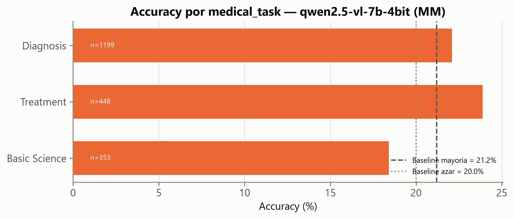
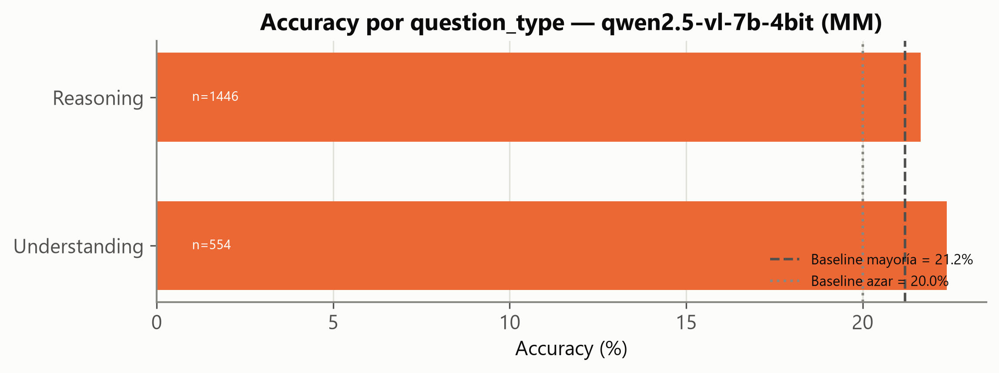

# Baseline Zero-Shot — MedXpertQA · MM (Paso 2, extensión multimodal)

- **Generado**: 2026-07-14T10:20:02.426608+00:00 (UTC), por `src/evaluate.py --subset mm` (semilla 42).
- **Fuente**: `TsinghuaC3I/MedXpertQA` (revisión `7e7c465a68eb2b866926bfa59c8c9d17a8daba65`), subconjunto **MM/test** (2.000 preguntas, 5 opciones A–E, 1–6 imágenes por pregunta).
- **Modelo**: `Qwen/Qwen2.5-VL-7B-Instruct`, 4-bit NF4 (idéntico al baseline de Text, ver [`02_baseline.md`](02_baseline.md)). Mismo prompt/parseo/harness; única diferencia: las imágenes se pasan **nativamente** (varias por prompt, sin mosaico), con un tope de resolución por imagen (`min_pixels=256·28², max_pixels=640·28²`) para no agotar los 8 GB de VRAM en preguntas con hasta 6 imágenes.
- **Trazabilidad**: predicciones en [`outputs/eval/mm_qwen2.5-vl-7b-4bit.jsonl`](../eval/mm_qwen2.5-vl-7b-4bit.jsonl); métricas en [`outputs/eval/metrics_mm_qwen2.5-vl-7b-4bit.json`](../eval/metrics_mm_qwen2.5-vl-7b-4bit.json).

> **VEREDICTO**: accuracy global **21.85 %** (IC95 Wilson [20.09 %, 23.71 %]). Supera el punto de la baseline de mayoría (21.20 %), **pero el IC95 se solapa con ella** — a diferencia del baseline de Text, aquí **no puede afirmarse con confianza estadística** que el modelo zero-shot aporte señal sobre la baseline trivial. Es el hallazgo más importante de este informe: en MM, tal como está configurado el harness, el modelo apenas se distingue de "responder siempre la letra más frecuente".

## 1. Configuración específica de MM

- **Imágenes nativas, no mosaico**: Qwen2.5-VL admite varias imágenes por prompt de forma nativa, así que cada imagen de la pregunta se pasa como un bloque `image` independiente en el mensaje, en el orden original, seguido del texto (enunciado + opciones).
- **Tope de resolución por imagen**: `max_pixels = 640×28²` (~501.760 px) por imagen, para mantener el uso de VRAM controlado incluso en preguntas con 6 imágenes en una GPU de 8 GB. Esto es una **decisión de compromiso, no gratuita**: reduce el detalle visual disponible al modelo, y es la sospechosa principal detrás de la caída de accuracy en preguntas multi-imagen (§3).
- **Sin fallback a 3B**: el 7B en 4-bit cupo en VRAM en todos los casos, incluida la pregunta con 6 imágenes (`cayo_a_3b_por_oom: false`). Uso pico observado ~7.98/8.19 GB (100 % de utilización de GPU sostenida).
- **Coste**: 3.687 s para 2.000 preguntas (≈1.84 s/pregunta), más de 3× el coste por pregunta de Text (0.56 s), como cabía esperar por el procesado visual.

## 2. Resultado global vs. baselines

| Métrica | Valor |
|---|---:|
| Accuracy global | **21.85 %** |
| IC95 (Wilson) | [20.09 %, 23.71 %] |
| Baseline azar (MM, 5 opciones) | 20.00 % |
| Baseline mayoría (letra E, de C.2) | 21.20 % |
| Respuestas no parseables | 0 / 2.000 |

Igual que en Text, el parseo fue perfecto (0 fallos): el resultado no está contaminado por errores de extracción de la letra.

## 3. Accuracy desagregada

### Por número de imágenes — el hallazgo central de este informe

| Nº imágenes | n | Accuracy |
|---:|---:|---:|
| 1 | 1.581 | **22.96 %** |
| 2 | 236 | 19.92 % |
| 3 | 59 | 11.86 % |
| 4 | 22 | 18.18 % |
| 5 | 78 | 16.67 % |
| 6 | 24 | 12.50 % |

Con **una sola imagen** (79 % de MM) el modelo sí se despega algo del azar (22.96 % vs. 20 %). En **preguntas multi-imagen** (21 % de MM, coherente con el 20.9 % ya cuantificado en el EDA C.4) la accuracy cae de forma consistente, llegando a situarse **por debajo del propio azar** en los grupos de 3 y 6 imágenes. La lectura más plausible no es que el modelo "razone peor" con más imágenes en abstracto, sino que el tope de resolución (`max_pixels`) aplicado por igual a cada imagen dejó las preguntas multi-imagen con menos detalle visual disponible por figura que las de una sola imagen — una limitación de esta configuración del harness, no necesariamente del modelo. Queda como decisión abierta para el Paso 3+: subir la resolución en preguntas multi-imagen (a costa de VRAM/tiempo) o probar composición en mosaico como alternativa.

### Por sistema corporal (`body_system`)

Rango de **14.3 % (Urinary, n=56)** a **28.9 % (Integumentary, n=225)**. Integumentary (dermatología) es, con diferencia, donde mejor rinde el modelo — plausible, dado que las lesiones cutáneas son visualmente más directas de clasificar que hallazgos radiológicos o histológicos sutiles.

### Por tarea médica (`medical_task`)

**Treatment** (23.9 %, n=448) > **Diagnosis** (22.1 %, n=1.199) > **Basic Science** (18.4 %, n=353). Orden distinto al de Text (donde Diagnosis era la tarea más débil): en MM, con apoyo visual directo, el diagnóstico ya no es el punto más débil — es Basic Science (mecanismos/fisiopatología) lo que peor rinde.

### Por tipo de pregunta (`question_type`)

**Understanding** (22.4 %, n=554) y **Reasoning** (21.6 %, n=1.446) quedan casi empatados — mucho más cerca entre sí que en Text (14.1 % vs. 11.7 %). La imagen parece nivelar parcialmente la ventaja que Understanding tenía en Text.

## 4. Primeros errores observados (inspección manual)

**Ejemplo de acierto** (`MM-1791`, 1 imagen): diagnóstico directo a partir de una imagen endoscópica ("Based on this image, what is the BEST diagnosis?") — el modelo acertó **D** (esofagitis por reflujo) entre 5 diagnósticos diferenciales de esofagitis con presentación visual similar.

**Ejemplo de error, 1 imagen** (`MM-392`): caso clínico de un viajero a la Amazonía con fiebre y síntomas gastrointestinales tras recolectar muestras de agua; el modelo predijo **E** ("infección reciente e inflamación sistémica") cuando la respuesta correcta era **A** (relacionada con virus de Epstein-Barr). Es un error de razonamiento clínico-textual, no de lectura de imagen: el modelo se queda con la explicación más genérica en vez de conectar los detalles específicos del caso.

**Ejemplo de error, multi-imagen** (`MM-94`, 3 imágenes de RM): paciente con dolor radicular y debilidad de EHL; el modelo predijo **C** (hernia discal far-lateral) cuando la respuesta correcta era **B** (quiste sinovial facetario) — dos causas de radiculopatía con apariencia en RM que pueden confundirse incluso con buena resolución, y aquí además compitiendo por presupuesto de píxeles entre 3 imágenes.

## 5. Decisiones y anomalías

- **Anomalía principal (no de infraestructura, de diseño)**: la caída de accuracy en preguntas multi-imagen sugiere que `max_pixels=640×28²` es demasiado agresivo cuando hay que repartirlo entre varias figuras. **No se corrige en este informe** (el Paso 2 es solo medición); se deja documentado como entrada directa para el diseño del Paso 3.
- **Ninguna caída a 3B**: el 7B cupo siempre, incluidas las preguntas de 6 imágenes.
- **Diferencia clave con Text**: en Text, el IC95 no se solapaba con la baseline de mayoría (mejora defendible). En MM, sí se solapa — el baseline zero-shot en MM, tal como está medido aquí, **no es distinguible de la baseline trivial** con este tamaño de muestra. Este matiz debe mantenerse al reportar el "delta" que aporten CoT/RAG en pasos posteriores: en MM, cualquier mejora futura debe compararse contra baseline_mayoria (21.2 %) con su propio IC, no solo contra el punto estimado de hoy.
- **Pendiente para el roadmap** (`01_PLAN_PASO_2.md` §8): con Text y MM ya medidos, el siguiente hito es el Paso 3 (CoT / *self-consistency*), previsiblemente sobre ambos subconjuntos.
