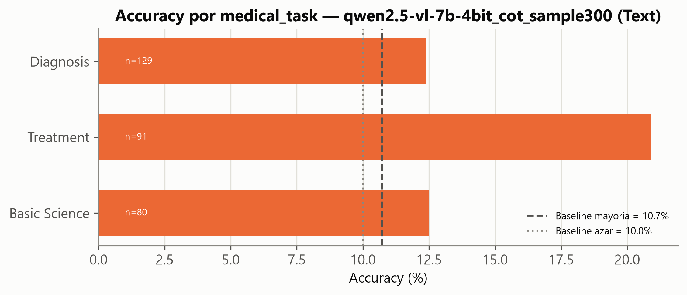

# Piloto Chain-of-Thought — MedXpertQA · Text (Paso 3)

- **Generado**: 2026-07-14 (UTC), por `src/evaluate.py --mode cot --sample 300` (semilla 42).
- **Alcance**: muestra **estratificada** de 300 preguntas de Text/test (proporcional a `question_type × medical_task`; ver `stratified_sample` en `src/evaluate.py`), no las 2.450 completas — decisión explícita para pilotar el diseño del prompt/parseo antes de comprometer el tiempo de GPU que exige la ejecución completa (ver §5).
- **Modelo**: idéntico al baseline directo (`Qwen/Qwen2.5-VL-7B-Instruct`, 4-bit NF4). Único cambio: *system prompt* que pide razonar brevemente (máx. 3 frases, sin listas/markdown) y concluir con una línea ancla `Final answer: <letra>`; `max_new_tokens=256` (frente a 8 en modo directo).
- **Trazabilidad**: predicciones en [`outputs/eval/text_qwen2.5-vl-7b-4bit_cot_sample300.jsonl`](../eval/text_qwen2.5-vl-7b-4bit_cot_sample300.jsonl); métricas en [`outputs/eval/metrics_text_qwen2.5-vl-7b-4bit_cot_sample300.json`](../eval/metrics_text_qwen2.5-vl-7b-4bit_cot_sample300.json).

> **VEREDICTO**: accuracy con CoT (cadena única) **15.00 %** (IC95 [11.40 %, 19.48 %]) vs. **12.67 %** en modo directo **sobre las mismas 300 preguntas** (delta +2.33 pp, McNemar p=0.31, no significativo). Con **self-consistency** (5 muestras + voto mayoritario) el resultado fue **12.00 %** — **no mejora sobre el directo (p=0.85) y tiende a ser peor que el CoT de cadena única (p=0.078)**. El hallazgo más importante de este piloto no es "el CoT mejora" sino que **el voto por mayoría entre muestras no ayudó**, y hay una hipótesis concreta de por qué (§4): cuando las 5 muestras coinciden, tienden a coincidir en la respuesta *incorrecta* casi tan a menudo como en la correcta — indicio de error sistemático del modelo, no de ruido de muestreo, que es precisamente el escenario donde self-consistency no puede ayudar por diseño.

## 1. Por qué un piloto y no las 2.450 completas

Una medición previa de velocidad de generación larga dio **~14 tokens/s** en la RTX 3070 (7B, 4-bit). Con el *system prompt* inicial (instrucciones en español, sin restringir el formato), el modelo generaba razonamientos largos en listas numeradas que agotaban `max_new_tokens` sin llegar a concluir — **3 de 5** preguntas de una prueba mínima quedaron cortadas a mitad de frase. Tras ajustar el *prompt* (instrucciones en inglés, prosa breve, sin markdown) el coste bajó de ~12s/pregunta a **~4.7s/pregunta**, y las 300 preguntas del piloto tardaron **1.403 s (~23 min)**. La ejecución completa sobre las 2.450 preguntas de Text tardaría, extrapolando, **~3.2 h** — factible pero deliberadamente pospuesta hasta confirmar que el diseño del *prompt* y del parseo son sólidos, que es precisamente lo que valida este informe.

## 2. Resultado global vs. baseline y vs. modo directo

| Métrica | Directo (300 preguntas) | CoT (300 preguntas) |
|---|---:|---:|
| Accuracy | 12.67 % | **15.00 %** |
| IC95 (Wilson) | — | [11.40 %, 19.48 %] |
| Baseline mayoría (Text) | 10.73 % | 10.73 % |
| No parseables | — | 0 / 300 |
| Coste medio | ~0.56 s/pregunta | ~4.68 s/pregunta (×8.4) |

El parseo con el ancla `Final answer: X` funcionó al 100 % (0 no parseables) tras el ajuste del *prompt* — importante porque el parser de CoT **no** usa el *fallback* genérico de letra suelta del modo directo: si el modelo no concluye con el ancla, se cuenta honestamente como fallo en vez de adivinar una letra mencionada de pasada al descartar opciones (ver docstring de `parse_answer_cot`).

## 3. Comparación pareada y significancia estadística

Comparar 15.00 % (CoT, n=300) contra el 12.24 % global de Text (n=2.450, informe [`02_baseline.md`](02_baseline.md)) sería engañoso: son muestras distintas. La comparación correcta es **pareada**, pregunta a pregunta, sobre las mismas 300:

| | CoT acierta | CoT falla |
|---|---:|---:|
| **Directo acierta** | 24 | 14 |
| **Directo falla** | 21 | 241 |

- Pares discordantes: 35 (14 donde el CoT empeoró una respuesta correcta, 21 donde la corrigió).
- Test de McNemar (con corrección de continuidad): χ²=1.03, **p=0.31**.

Con solo 35 pares discordantes, el piloto no tiene potencia estadística suficiente para distinguir una mejora real de ruido de muestreo — el intervalo de confianza del delta es amplio. Es un resultado **direccionalmente alentador pero no concluyente**.

## 4. Self-consistency: 5 muestras + voto mayoritario

Mismas 300 preguntas, mismo *prompt* de CoT, pero `do_sample=True` (`temperature=0.7`, `top_p=0.9`), 5 muestras por pregunta, y la letra ganadora por mayoría simple (empate → gana la primera muestra). Coste: ~22s/pregunta (5× el coste del CoT de cadena única), **6.606 s (~1h50) para las 300 preguntas**.

| | Directo | CoT (1 cadena) | CoT + self-consistency (5 muestras) |
|---|---:|---:|---:|
| Accuracy (mismas 300) | 12.67 % | **15.00 %** | 12.00 % |
| IC95 (Wilson, muestra completa) | — | [11.40 %, 19.48 %] | [8.80 %, 16.17 %] |
| Coste/pregunta | ~0.56 s | ~4.7 s | ~22 s |

**Comparaciones pareadas (McNemar, corrección de continuidad):**

| Comparación | Pares discordantes | χ² | p |
|---|---:|---:|---:|
| Directo vs. CoT (1 cadena) | 35 (14/21) | 1.03 | 0.31 |
| Directo vs. CoT+SC (5) | 26 (14/12) | 0.04 | **0.85** |
| CoT (1 cadena) vs. CoT+SC (5) | 21 (15/6) | 3.05 | 0.078 |

Ninguna comparación alcanza significancia al 0.05, pero el patrón es consistente: self-consistency no distingue de responder directamente (p=0.85, prácticamente empatados), y hay una tendencia (no concluyente, p=0.078) a que la cadena única de CoT rinda **mejor** que el voto por mayoría de 5.

**¿Por qué no ayudó el voto por mayoría?** Se desglosó la accuracy según cuántas de las 5 muestras coincidieron en la letra ganadora:

| Votos de la letra ganadora (de 5) | n preguntas | Accuracy |
|---:|---:|---:|
| 2 | 55 | 9.1 % |
| 3 | 79 | 13.9 % |
| 4 | 69 | 14.5 % |
| 5 (unanimidad) | 94 | **10.6 %** |

Si el desacuerdo entre muestras fuera solo ruido aleatorio, cabría esperar que la accuracy **subiera monótonamente** con el nivel de consenso (más unanimidad → más fiable). No es así: el grupo con unanimidad total (94 preguntas, el 31 % del piloto) rinde **peor** que los grupos con consenso parcial (4/5). La lectura más plausible: en una fracción sustancial de las preguntas, el modelo tiene un **error sistemático** (una idea errónea consistente, no una duda que el muestreo aleatorio resuelva) — las 5 muestras convergen en la misma respuesta *incorrecta* casi con la misma frecuencia que en la correcta. Self-consistency, por construcción, solo puede corregir desacuerdo debido a variabilidad estocástica; no corrige un sesgo compartido por todas las muestras. Esto es coherente con el patrón ya visto en el baseline directo (informe 02): el modelo tiende a responder con el diagnóstico/mecanismo *más común* en vez del que realmente señalan los detalles del caso, y ese sesgo se reproduce igual de determinista con `temperature=0.7` que con *greedy*.

## 5. Desagregación (piloto CoT de cadena única, n=300)

| Eje | Categoría | n | Accuracy CoT |
|---|---|---:|---:|
| `question_type` | Reasoning | 228 | 14.9 % |
| `question_type` | Understanding | 72 | 15.3 % |
| `medical_task` | Treatment | 91 | **20.9 %** |
| `medical_task` | Diagnosis | 129 | 12.4 % |
| `medical_task` | Basic Science | 80 | 12.5 % |

Figuras completas: 

Treatment es la tarea que más se beneficia del razonamiento explícito en este piloto (20.9 % vs. 14.5 % en modo directo sobre el conjunto completo, informe 02). Diagnosis, el punto más débil en modo directo, sigue rezagado incluso con CoT — hipótesis a confirmar con la ejecución completa: puede que el diagnóstico diferencial necesite más que "pensar un poco más" (p. ej. RAG con conocimiento clínico específico, Paso 4).

## 6. Ejemplos ilustrativos (ambas direcciones, CoT de cadena única)

**El CoT corrige un error** (`Text-1146`): pregunta sobre neuropatía asociada a un hallazgo en la mano (vídeo/figura). El modo directo respondió **H** (incorrecto); con CoT, el modelo razona explícitamente sobre la atrofia de la eminencia tenar y concluye correctamente **D** (rama profunda del nervio cubital) — un caso donde verbalizar el hallazgo clave antes de responder sí ayuda.

**El CoT estropea un acierto** (`Text-531`): paciente post-trasplante hepático con alteración del estado mental. El modo directo acertó **H**; con CoT, el modelo se centra en la inmunosupresión (razonamiento plausible pero no el que pedía la pregunta) y concluye **B**, incorrecto. Ilustra el riesgo conocido del CoT zero-shot: verbalizar una hipótesis intermedia razonable puede desviar la respuesta final aunque el modelo "sepa" la respuesta correcta en modo directo.

## 7. Decisiones y próximos pasos

- **Self-consistency descartada, de momento**: con 5 muestras no mejora sobre el directo y tiende a ser peor que el CoT de cadena única. No se recomienda invertir las ~1.8h que costaría escalarla a las 2.450 preguntas completas sin antes revisar el diseño (más muestras, otra temperatura, u otro mecanismo de agregación que no sea voto simple) — no es un descarte definitivo de la técnica, sino de esta configuración concreta.
- **CoT de cadena única sigue siendo la opción más prometedora** del Paso 3, aunque no significativa a n=300: es 8× más barata que self-consistency y su delta pareado (+2.33 pp) va en la dirección correcta. Candidata natural para la ejecución completa (2.450, ~3.2h) si se prioriza cerrar el Paso 3 con un número robusto.
- **Hallazgo con valor propio para el capítulo de errores**: la caída de accuracy en preguntas con unanimidad de muestras (§4) es evidencia de error sistemático (no de incertidumbre resoluble por muestreo) en una fracción sustancial de las preguntas — coherente con el patrón "responde el diagnóstico más común, no el que señala el caso" ya visto en el baseline (informe 02). Argumento de peso a favor de **RAG (Paso 4)** sobre más CoT: si el problema es una idea errónea sistemática, aportar conocimiento clínico específico por recuperación es más prometedor que pedirle al modelo que "piense más".
- **Diseño validado**: *system prompt* en inglés + restricción de formato (prosa breve, sin listas) + ancla `Final answer: X` + parseo estricto (sin *fallback* genérico) es el diseño a mantener para cualquier extensión de CoT (Text completo, MM).
- **Pendiente**: replicar el piloto (CoT y/o self-consistency) sobre MM para ver si el patrón se sostiene con imágenes.
